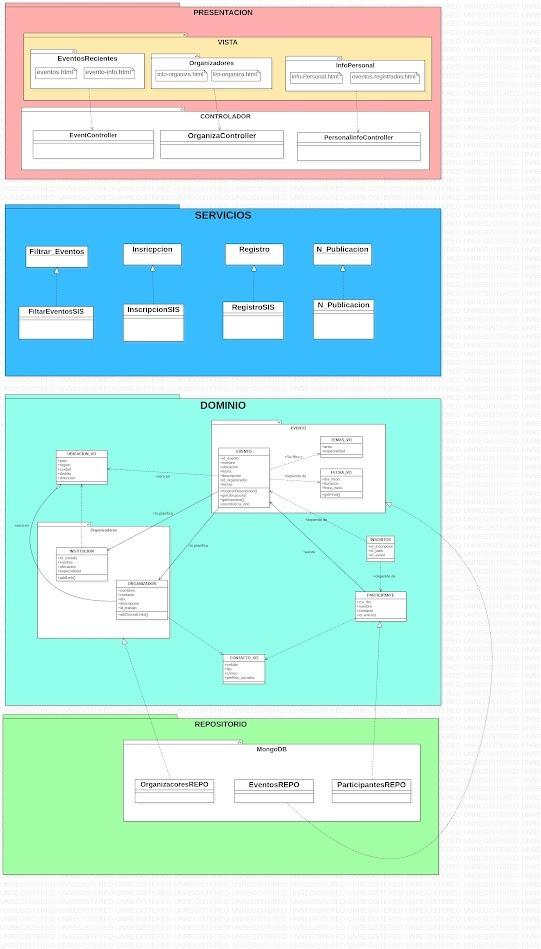

# Sistema de Publicación de Eventos Relacionados a Computación


[Live demo](https://eventos-cs.netlify.app)

## Descripción

SPERC es una plataforma diseñada para facilitar la organización y promoción de eventos, tales como conferencias, talleres, seminarios y hackathons, relacionados con la ciencia de la computación y disciplinas afines. La aplicación proporciona una interfaz intuitiva y fácil de usar para los organizadores y participantes.

## Características clave

- Registro de Eventos: Los organizadores pueden crear nuevos eventos, proporcionando detalles esenciales como título, descripción, fechas, ubicación y enlaces relevantes.

- Gestión de Participantes: Los interesados en asistir a un evento pueden registrarse a través de la plataforma, lo que permite a los organizadores llevar un registro de la asistencia y planificar adecuadamente.

- Calendario de Eventos: SPERC presenta un calendario interactivo que muestra todos los eventos registrados, permitiendo a los usuarios filtrarlos según su interés y disponibilidad.

- Notificaciones: Los participantes pueden optar por recibir notificaciones sobre eventos próximos, cambios de horario o actualizaciones importantes.

- Comentarios y Calificaciones: Después de cada evento, los asistentes tienen la oportunidad de dejar comentarios y calificaciones, lo que ayuda a otros usuarios a tomar decisiones informadas sobre qué eventos les interesan.

## TRELLO
https://trello.com/invite/b/bBmltJB0/ATTI1698520f44d31836dcdbc30b7399055b6AD9CAB3/tablero-kanban

## TECNOLOGIAS
**SvelteKit:** Un marco de trabajo de desarrollo web enriquecido en características, que facilita la creación de aplicaciones web eficientes y de alto rendimiento utilizando componentes reactivos.
**PocketBase:** Una base de datos liviana y de alto rendimiento diseñada para aplicaciones web modernas, que ofrece una solución de almacenamiento escalable y segura.

## PERSPECTIVA DEL PRODUCTO 
La funcionalidad principal del sistema incluiye:
- Registro de usuarios: permitirá a los usuarios crear perfiles y acceder al sistema.
- Publicación de eventos: los usuarios podrán agregar información sobre los eventos que deseen publicar, incluyendo detalles como título, descripción, fechas, ubicación, categoría, entre otros.
- Búsqueda de eventos: los usuarios podrán buscar eventos utilizando filtros de categoría, fecha y ubicación.
- Comunicación entre usuarios: los participantes podrán comunicarse a través del la caja de comentarios de los diferentes eventos.

## FUNCIONALIDAD DEL PRODUCTO
La funcionalidad principal del sistema incluye:
- Registro de usuarios: Los usuarios podrán registrarse y acceder al sistema de forma segura y confiable.
- Publicación de eventos: Los usuarios tendrán la capacidad de agregar información detallada sobre los eventos que deseen compartir, incluyendo datos como título, descripción, fechas, ubicación, categoría, y otros campos relevantes.
- Búsqueda de eventos: Los usuarios podrán realizar búsquedas precisas utilizando filtros de categoría, fecha y ubicación para encontrar eventos de su interés de manera rápida y eficiente.

## RESTRICCIONES
El desarrollo del sistema de Publicación de Eventos Relacionados a Computación se encuentra sujeto a las siguientes restricciones:
- Lenguaje de programación: El sistema será desarrollado utilizando el lenguaje de programación JavaScript.
- Simplicidad: El sistema se diseñará y desarrollará siguiendo una aproximación de simplicidad, priorizando la facilidad de uso y la claridad en la interfaz de usuario.
- Plataformas compatibles: El sistema se desarrollará para ser compatible con las plataformas web modernas y los navegadores más utilizados, como Google Chrome, Mozilla Firefox y Microsoft Edge.
- Tecnologías adicionales: Además de JavaScript, se permitirá el uso de tecnologías relacionadas como HTML, CSS y frameworks de JavaScript para el desarrollo del sistema, siempre y cuando cumplan con los estándares y requisitos técnicos establecidos.
- Integraciones externas: El sistema podrá integrarse con servicios externos y APIs para obtener información adicional sobre los eventos o para proporcionar funcionalidades adicionales, siempre y cuando se cumplan los requisitos técnicos y de seguridad correspondientes.
- Escalabilidad: El sistema deberá ser diseñado de manera que pueda gestionar un crecimiento en la cantidad de eventos y usuarios sin comprometer el rendimiento y la estabilidad.
- Seguridad: El sistema deberá implementar medidas de seguridad adecuadas para proteger la información de los eventos y los datos de los usuarios, evitando accesos no autorizados y asegurando la confidencialidad, integridad y disponibilidad de los datos.

## Propósito del Proyecto
El propósito del proyecto es desarrollar una plataforma llamada SPERC (Sistema de Publicación de Eventos Relacionados a Computación) que facilite la organización y promoción de eventos relacionados con la ciencia de la computación y disciplinas afines. La plataforma proporcionará a los organizadores una interfaz intuitiva para crear y gestionar eventos, y permitirá a los participantes encontrar eventos de su interés.

## Funcionalidades
### Diagrama de Casos de Uso:


### Prototipo o GUI:
Se proporciona un enlace al prototipo interactivo de la interfaz de usuario [aquí](https://eventos-cs.netlify.app)

## Modelo de Dominio
### Diagrama de Clases:


### Diagrama de Módulos:


## Arquitectura y Patrones
### Diagrama de Componentes o Paquetes:
Mostrar cómo se estructuran los componentes o paquetes en el sistema. Puede representar capas como "Interfaz de Usuario", "Lógica de Negocios", "Persistencia de Datos", etc.

## Prácticas de Codificación Limpia
Describir cómo se aplican prácticas de codificación limpia en el proyecto, como seguir nombres descriptivos para variables y funciones, evitar duplicación de código, escribir comentarios claros y concisos, etc.

## Estilos de Programación
**Programación Orientada a Componentes:**
El enfoque central del desarrollo se basa en la creación de componentes reutilizables y autónomos. Cada componente encapsula su funcionalidad y presenta una interfaz coherente.


>Se aplica este estilo diviendo las responsabilidades del back y front - end en componentes como cabecera, eventos, autenticación, etc.

**Separación de Preocupaciones:**
Se sigue el principio de separación de preocupaciones para mantener el código organizado y comprensible. La lógica de presentación, la lógica de negocios y la interacción con la base de datos se mantienen en áreas distintas.
```
API_URL="https://eventos-cs.pockethost.io/"
```
>En nuestro caso, la bd se maneja a  través  de un API-URL y manejo de ORM's para solicitar datos
```javascript
export const load =({locals, params}) => {
    const getEvent = async (eventoID) => {
        try{
            const evento = serializeNonPOJOs(await locals.pb.collection('eventos').getOne(eventoID));
            return evento;
        } catch (err) {
            console.log("Error: ",err);
            throw error(err.status, err.message);
        }
    };
    return{
        event: getEvent(params.eventId)
    }
}
```

**Mantenibilidad y Escalabilidad:**
El código se estructura de manera modular para facilitar la mantenibilidad y escalabilidad del sistema. Los componentes se diseñan de forma que puedan extenderse o modificarse con relativa facilidad.


**Uso de Nombres Descriptivos:**
Las variables, funciones y clases se nombran de manera significativa y descriptiva, lo que permite a los desarrolladores entender rápidamente su propósito y funcionalidad.
```javascript
export const getURLImagen = (tablaID, registroId, nombreArchivo, tamano = '80x80') => {
  return `https://eventos-cs.pockethost.io/api/files/${tablaID}/${registroId}/${nombreArchivo}?thumb=${tamano}`;
};
```
>Por ejemplo,en esta funcion queda muy claro que esta sección de código es una función que extrae el url desde la api, a aprtir de los atributos como el id de la tabla, el id del dato solicitado y el el nombre del archivo

**ADVERSITY PROGRAMMING STYLE**
El tratar de maneejar errores,para evitar la caida del sistema.

```javascript
const formData = Object.fromEntries([...(await request.formData())]);
    try {
      await locals.pb
        .collection("eventos")
        .create(serialize({ ...formData, organizador: locals.user.id }));
      console.log("formData:");
    } catch (err) {
      console.log("Error: ", err);
      throw error(err.status, err.message);
    }
```
> En caso se genere un evento y este ya existe o tiene algun error al pasarlo a la BD se muestra error al usuario, pero le permite continuar en el sistema'

## Principios SOLID
### Descripción:
Explicar cómo se aplican los principios SOLID (Single Responsibility, Open/Closed, Liskov Substitution, Interface Segregation, Dependency Inversion) en el diseño y la implementación del sistema.

### Fragmento de Código (evidencia):
**Single Responsibility Principle **(Principio de Responsabilidad Única)
La clase EventoService se encarga exclusivamente de la lógica relacionada con los eventos:
``` javascript
Copy code
export function load({ fetch, locals }) {
  const getEventos = async () => {
    // Lógica para crear un nuevo evento
  }

  const actualizarEvento = async (evento) => {
    // Lógica para actualizar un evento existente
  }
}
```
**Principio de abierto/cerrado (OCP)**
La página debe ser extensible sin modificar su código existente. Esto se puede hacer utilizando interfaces y abstracciones. Por ejemplo, la página podría usar una interfaz EventRepository para acceder a los datos de eventos. Esto haría posible cambiar el repositorio de datos sin modificar el código de la página.
```javascript
interface IEvento {
  id: string;
  titulo: string;
  descripcion: string;
  fecha: string;
  miniatura: string;
}
```
**Principio de sustitución de Liskov (LSP)**
Las clases derivadas deben poder usarse en lugar de las clases base sin provocar errores. Esto se puede hacer asegurando que las clases derivadas cumplan con los contratos de las clases base. 
```javascript
//hocks.server.ts
export async function handle({ event, resolve }) {
  event.locals.pb = new PocketBase(env.API_URL);
  /////////////////////////////
}
```
**Principio de separación de interfaces (ISP)**
Una clase no debe verse obligada a implementar métodos que no utiliza. Esto hace que el código sea más fácil de entender y mantener. Por ejemplo, una clase Event no debería tener que implementar un método save si no necesita guardarse en la base de datos.
```js
//Crear evento
export const load = ({ locals }) => {
  if (!locals.pb.authStore.isValid) {
    throw redirect(303, "/auth/login");
  }
};

export const actions = {
  new: async ({ request, locals }) => {
    const formData = Object.fromEntries([...(await request.formData())]);
    //Logica de crear nuevo evento
  },
};
```

**Principio de inversión de dependencia (DIP)**
Los componentes de la página no deben depender de implementaciones específicas. En cambio, deben depender de abstracciones. Esto hace que la página sea más flexible y fácil de mantener.
```js
//Pocketbase sdk
export async function handle({ event, resolve }) {
  event.locals.pb = new PocketBase(env.API_URL);
  /////
}
```
## Conceptos DDD (Domain-Driven Design)
### Modelos
Los modelos son objetos que representan entidades en el dominio del problema. Por ejemplo, un modelo para una página de eventos de computación podría ser un evento. Un evento tendría propiedades como el nombre, la fecha, la hora y la ubicación del evento.
```js
// Este es el modelo `Event`.
interface Event {
  name: string;
  date: Date;
  time: Date;
  location: string;
}
```
### Repositorios
Los repositorios son responsables del acceso a los datos. Un repositorio para una página de eventos de computación podría ser un repositorio de eventos. Un repositorio de eventos sería responsable de acceder a los eventos de la base de datos.
```js
// Este es el repositorio `EventRepository`.
class EventRepository {
  constructor(private readonly pocketBaseClient: PocketBaseClient) {}

  async fetchEvents() {
    const events = await this.pocketBaseClient.query('events');
    return events;
  }

//CRUD
}
```
### Servicios
Los servicios son responsables de realizar operaciones en los datos. Un servicio para una página de eventos de computación podría ser un servicio de eventos. Un servicio de eventos sería responsable de crear, actualizar y eliminar eventos.
```js
// Este es el servicio `EventService`.
class EventService {
  constructor(private readonly eventRepository: EventRepository) {}

  async createEvent(event: Event) {
    return await this.eventRepository.createEvent(event);
  }

  async updateEvent(event: Event) {
    return await this.eventRepository.updateEvent(event);
  }

  async deleteEvent(eventId: number) {
    return await this.eventRepository.deleteEvent(eventId);
  }
}
```
### Vistas
Las vistas son responsables de mostrar los datos al usuario. Una vista para una página de eventos de computación podría ser una vista de lista de eventos. Una vista de lista de eventos sería responsable de mostrar una lista de eventos al usuario.
```svelte
 <div id = "contenedorC">
    <section>
      <h2>Eventos Próximos</h2>
      <form id="search-form">
        <label for="search-input">Buscar por nombre:</label>
        <input type="text" bind:value={search_text} on:input={searchBooks} />
        <button type="submit">Buscar</button>
      </form>
      <div id="event-list">
        {#each eventos as evento}
          <div id="eventoInvidual">
                <h3>
                  {evento.titulo}
                  {//Datos de evento}
                </h3>
          </div>
        {/each}
      </div>
    </section>
```

### "Arquitectura en Capas"
El sistema sigue un enfoque de arquitectura en capas para garantizar la separación de preocupaciones y la modularidad. Las capas principales del sistema son:

**Capa de Presentación:**
Esta capa se encarga de la interfaz de usuario y la interacción con los usuarios. Aquí es donde se crean y gestionan los componentes visuales utilizando SvelteKit. La capa de presentación también maneja la entrada y salida de datos a través de formularios y eventos de usuario.

**Capa de Lógica de Negocios:**
En esta capa, reside la lógica empresarial principal del sistema. Se encarga de procesar las solicitudes del usuario, aplicar reglas de negocio y coordinar la interacción entre los componentes. Aquí es donde se encuentran los servicios que gestionan la lógica detrás de las operaciones del sistema, como la creación y actualización de eventos.

**Capa de Persistencia de Datos:**
Esta capa se ocupa de la persistencia de datos y la comunicación con la base de datos, en este caso, PocketBase. Los servicios de esta capa gestionan la consulta y escritura de datos en la base de datos, permitiendo que la capa de lógica de negocios se mantenga independiente de los detalles de almacenamiento.

**Capa de Servicios Externos:**
Si el sistema se integra con servicios externos o APIs, esta capa se encarga de la comunicación y gestión de esas integraciones. Por ejemplo, si se envían notificaciones a través de un servicio de mensajería externo, esta capa se encargaría de esa interacción.
